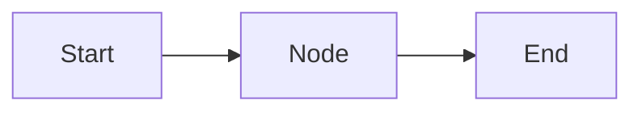
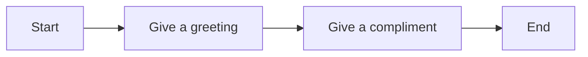
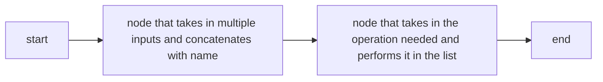
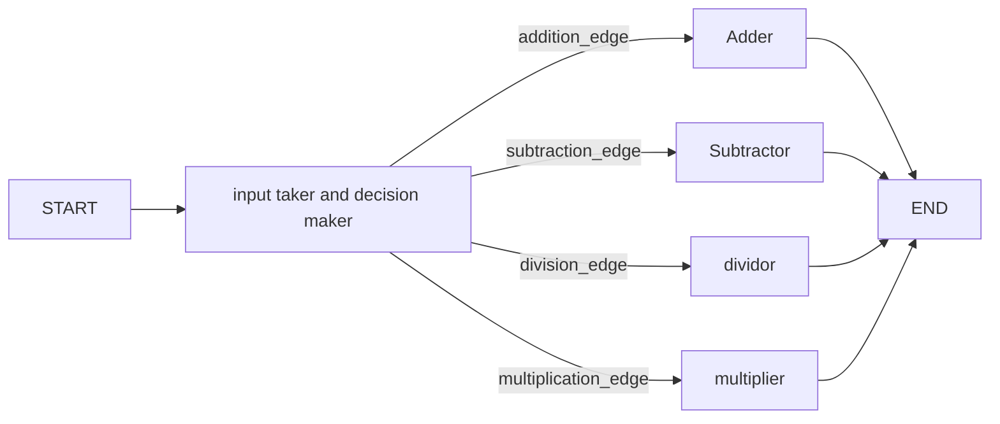
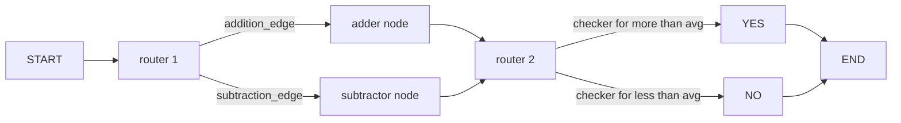
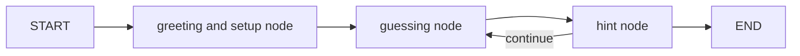

# Following along to the [tutorial](https://www.youtube.com/watch?v=jGg_1h0qzaM) and learning LangGraph

## What is LangGraph?
AI Library for building advanced conversational workflows. Will learn how to manage complex conversational systems using graphs.

### Typed Dictionaries: A new kinda dict.
So basically conventional python dictionaries are hard to use in large projects since they dont have a check on the type of data they're storing, so it becomes hard to validate that debug it later on. We instead use **typed dictionaries**.
```python
from typing import TypedDict
class Movie(TypedDict):
    name: str,
    year: int
movie = Movie(name="Avengers", year=2012)
```
In this way, we have defined the actual datatype that the dict values should have, so that reduces runtime/logical errors later on and makes debugging in general easier.

### Union: another type of annotation like typed dicts.
This is similar, basically lets you specify the datatypes a variable can have and the types that you dont want. eg: if a variable $x$ can be an int or a float but not a string, we can use `Union[int, float]` to specify that.
```python
from typing import Union
def square(x: Union[float, int]) -> float:
    return x**2
x = 5 # works because int
x = 1.5 # works because float
x = "hi" # doesnt work because not int or float
```

### Optional: yet another type of annotation like union. 
This is again similar, but in this case the type you can enter in the function can only be what you specified using `Optional[type]`, anything else would give an error. Whereas, if you choose not to pass in anything, it will default to `None`. 
```python
from typing import Optional
def printname(name: Optional[str]) -> None:
    if name is None:
        print("No name entered")
    else:
        print(f"Name entered is: {name}")
printname(10) # prints no name entered, name defaults to value None since a wrong datatype is entered
printname("Dhruv") # name is stored as a string, executes the else block.
```

### Any: the simplest type of annotation.
It can take any datatype. (not sure why this is necessary, because this is basically any python variable, i guess the only use is probably while reading the code its easier to know or something). syntax `def fn(x: Any):` types.

# Elements of LangGraph

### Graph:
The overall structure, maps out how different nodes are connected and executed. Visually represents the workflow, showing the sequence and conditional paths between the operations. (ie, **basically a flowchart/roadmap of sorts)**
### State:
It's basically the application's memory at some point of time. It's a shared data structure that holds the current information/context of the entire application. 
### Nodes:
Individual functions or operations that perform specific tasks within the graph. Each node receives input (usually this input is just the current state), processes it and produces an output (usually an updated state.)
### Edges:
The connections between nodes that determine the flow of execution. (basically just the lines joining the nodes conditionally in a roadmap.). **Conditional Edges** decide what to do next based on what happened till now /which condition was satisfied.
### START node:
It is the virtual entry point in LangGraph, doesnt perform any operations but serves as a designated start location for execution.
### END node(s):
Upon reaching this node, the stopping point is reached and it signifies that all necessary operations in the workflow have been completed and the graph has finished executing.
### Tools:
Specialised functions or utilities that nodes can use to perform specific tasks (like fetching data from an API). They give additional functionality to nodes and are basically the things that make it agentic.\
Note: Nodes are part of the graph structure, tools are functionalities used within nodes.
### ToolNode:
Special kind of node whose main job is to run a tool. Connects the tool's output to the State, so the other nodes can use that information. (imagine calling the toolnode as an alternative to calling a tool inside a node, since a toolnode will publish the information after using the tool to the current state, and this info can be accessed by all other nodes because of this.)
### StateGraph:
Class in langgraph used to build and compile the graph structure. it manages the nodes, edges, overall State, ensuring that the workflow operates in a unified way and data flows correctly between the components. (ie, the manager of a factory basically)
### Runnable: (similar to LangChain):
Standardized, executable component that performs a specific task within an AI workflow. Serves as a fundamental building block, allowing for the creation of modular systems.\
Runnables can be combined to make sophisticated AI workflows.

## Types of messages in LangGraph
(Similar to LangChain.)
- **Human Message**: Represents input from a user.
- **System Message**: Provides instructions/context to the model.
- **Function Message**: Represents the result of a function call.
- **AI Message**: Represents responses generated by AI models.
- **Tool Message**: Similar to Function Message, but specific to tool usage.

# MAKING BASIC GRAPHS: Without using AI agents

## Our first graph (simple node based)
### filename: `firstGraph.ipynb`
So this just involved learning the basics of LangGraph and making two simple graphs of the form:

and


## Our second graph (multiple inputs)
### filename: `secondGraph.ipynb`
Basically learnt how to take multiple inputs in the form of a list and work on them, ended up making this sort of graph:


## Our third graph (sequential and conditional graphs)
### filename: `thirdGraph.ipynb`
In the tutorial, this was meant to be a sequential graph, but since I already finished that in the previous two notebooks, I'm going to use this for conditional graphs. Built two conditional graphs:

and



## Our fourth graph (graphs that involve looping)
### filename: `fourthGraph.ipynb`
Saw how looping can be used to iteratively keep going back to some node / sequence of nodes until a condition is satisfied.\
Made a game that guesses a number.


# THE FUN PART BEGINS: Involving AI Agents in our graphs
